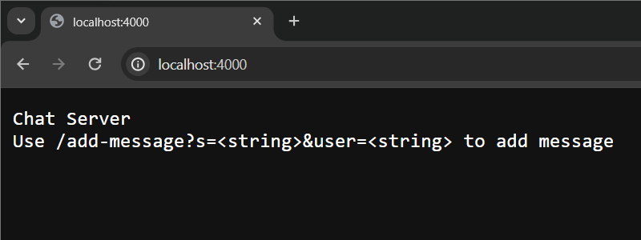
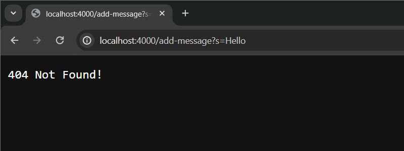
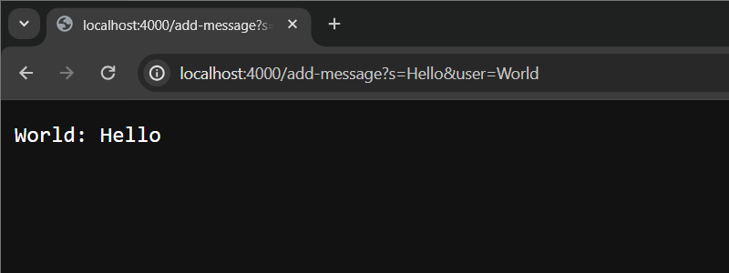
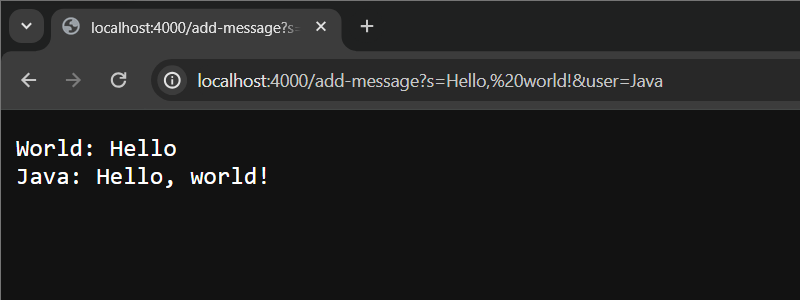

# **Lab Report - 2**

The folder structure is as follows:
```bash
/home/gram:
  .ssh  wavelet

/home/gram/.ssh:
  id_rsa  id_rsa.pub  known_hosts

/home/gram/wavelet:
  ChatServer.class  README.md      Server.java   URLHandler.class
  ChatServer.java   Handler.class  Server.class  ServerHttpHandler.class

skavuri@ieng6.ucsd.edu:/home/linux/ieng6/oce/73/skavuri:
  .ssh

skavuri@ieng6.ucsd.edu:/home/linux/ieng6/oce/73/skavuri/.ssh:
  authorized_keys
```

## ChatServer

The following code implements the expected functionality for the ChatServer program. 

```java
import java.io.IOException;
import java.net.URI;

class Handler implements URLHandler {
    String chatMessages = "";

    public String handleRequest(URI url) {
        if (url.getPath().equals("/")) {
            return String.format("Chat Server\nUse /add-message?s=<string>&user=<string> to add message");
        }
        else {
            if (url.getPath().contains("/add-message")) {
                String[] parameters = url.getQuery().split("=");
                if (parameters[0].equals("s")) {
                    try {
                        chatMessages = chatMessages + String.format("%s: %s\n", parameters[2], parameters[1].split("&")[0]);
                        return chatMessages;
                    }
                    catch(Exception e){
                        return "404 Not Found!";
                    }
                }
            }
            return "404 Not Found!";
        }
    }
}

class ChatServer {
    public static void main(String[] args) throws IOException {
        if(args.length == 0){
            System.out.println("Missing port number! Try any number between 1024 to 49151");
            return;
        }

        int port = Integer.parseInt(args[0]);

        Server.start(port, new Handler());
    }
}
```

When the code is first run with an appropriate port(4000 has been used for the examples that follow), the main method is run. The port number is retrieved from the 0th index of the args array. This value is then passed to the `start()` method of the Server class along with an instance of the Handler class.

The `chatMessages` string is then initialized to be empty.

When a client accesses the webpage, the `handleRequest` method is called and the URL being accessed is passed through in the method call. Here, `URI url` is being updated. This is handled in the backend within the Server class.

The method then uses an if-else condition to check for various requests.

The code implements support for the following requests:
- `/`
- `/add-message?s=<string>&user=<string>`
---
When `/` is accessed, a message is displayed as follows that demonstrates the correct usage of the program.



###### The URL accessed is `localhost:4000/`
##### In this case, the URI `url` contains `/`, and the String `chatMessages` is not altered. A formatted String is returned which details the appropriate usage of the program.

---

`/add-message` expects 2 query parameters, namely - `s`, the message that the user wants to send, and `user`, the current user's username. When either one of these parameters is defined illegally, a 404 error is thrown. 

> NOTE: The username can not be empty but the message string has no such rule.



###### The URL accessed is `localhost:4000/add-message?s=Hello`
##### In this case, the URI `url` contains `/add-message?s=Hello`, and the String `chatMessages` is not altered. The String array `parameters` is populated by the method call `GetQuery()` that is called on the `url` object which is then split at `=`. In the return statement, index 2 of the parameters array is being accessed. However, only one argument was provided. So, an exception is thrown which is then caught by the try-catch block. A `404 Not Found!` error is then returned.

---

When `/add-message` is accessed with the right parameters, the message provided in the parameters is printed on the webpage.




###### The URL accessed is `localhost:4000/add-message?s=Hello&user=World`
##### In this case, the URI `url` contains `/add-message?s=Hello&user=World`, and the String `chatMessages` is appended to. The String array `parameters` is populated by the method call `GetQuery()` that is called on the `url` object which is then split at `=`. The String that is appended is in the format `<user>: <message>`. This String is then returned which is printed on the webpage.

---

This process can be repeated multiple times to append more messages to the webpage.



###### The URL accessed is `localhost:4000/add-message?s=Hello,%20world!&user=Java`
##### In this case, the URI `url` contains `/add-message?s=Hello,%20world!&user=Java`, and the String `chatMessages` is appended to. The String array `parameters` is populated by the method call `GetQuery()` that is called on the `url` object which is then split at `=`. The String that is appended is in the format `<user>: <message>`. This String is then returned which is printed on the webpage. It is to be noted that the previous message is retained.

---

## `ssh`

When `ssh-keygen` is run, the private and public ssh keys are created in the `~/.ssh/` directory. 

```bash
gram@Harsha-Gram:~$ ssh-keygen
Generating public/private rsa key pair.
Enter file in which to save the key (/home/gram/.ssh/id_rsa):
Enter passphrase (empty for no passphrase):
Enter same passphrase again:
Your identification has been saved in /home/gram/.ssh/id_rsa
Your public key has been saved in /home/gram/.ssh/id_rsa.pub
The key fingerprint is:
SHA256:yQScXFEODxTZxLjUAlPlozaCNqz39asIyIXlllK30SY gram@Harsha-Gram
The key's randomart image is:
+---[RSA 3072]----+
|     o+*O%+      |
|      ++=*+      |
|    o E.+o=      |
|   * + B.o .     |
|  o X o S        |
| . B . o .       |
|  + o   .        |
|   . o o .       |
|      o ..o.     |
+----[SHA256]-----+
```

Upon navigating to the `.ssh` directory, we can see 3 files, namely
- the private key
- the public key
- a list of known hosts

```bash
gram@Harsha-Gram:~/.ssh$ ls
id_rsa  id_rsa.pub  known_hosts
```

The absolute paths to the private and public keys can be obtained by running the `ls` command with the files as the parameter.

```bash
ls /home/gram/.ssh/id_rsa*
/home/gram/.ssh/id_rsa  /home/gram/.ssh/id_rsa.pub
```

The file with the `.pub` extension is the public key. This file is to be copied to the ieng6 machine using `scp`. The private key is named `id_rsa`.

```bash
gram@Harsha-Gram:~/.ssh$ scp id_rsa.pub skavuri@ieng6.ucsd.edu:~/.ssh/authorized_keys
(skavuri@ieng6.ucsd.edu) Password:
id_rsa.pub                                                                            100%  570   104.6KB/s   00:00
```

The public key of the local machine is now added to the `authorized_keys` file on the remote ieng6 machine. 

```bash
[skavuri@ieng6-201]:~:100$ ls /home/linux/ieng6/oce/73/skavuri/.ssh/authorized_keys
/home/linux/ieng6/oce/73/skavuri/.ssh/authorized_keys
```

The remote machine can now be logged into without explicitly typing the password. 

```bash
gram@Harsha-Gram:~/.ssh$ ssh skavuri@ieng6-201.ucsd.edu
Last login: Mon Jan 29 10:36:33 2024 from 100.82.163.65
quota: Cannot resolve mountpoint path /home/linux/dsmlp/.snapshot/daily.2024-01-12_0010: Stale file handle
Hello skavuri, you are currently logged into ieng6-201.ucsd.edu

You are using 0% CPU on this system

Cluster Status
Hostname     Time    #Users  Load  Averages
ieng6-201   12:00:01   2  0.14,  0.49,  0.46
ieng6-202   12:00:01   2  0.01,  0.12,  0.22
ieng6-203   12:00:01   0  0.01,  0.09,  0.16


To begin work for one of your courses [ cs15lwi24 ], type its name
at the command prompt.  (For example, "cs15lwi24", without the quotes).

To see all available software packages, type "prep -l" at the command prompt,
or "prep -h" for more options.
[skavuri@ieng6-201]:~:90$
```


## Learning Outcome of Weeks 2 and 3

I learned about the Server class, and URL and query handling in Java, something I had never dealt with before. I also gained a deeper understanding of `ssh`. Despite having used `ssh` in the past, I had not dealt with keys. I found that it greatly reduces the effort when logging into a remote machine repeatedly.


