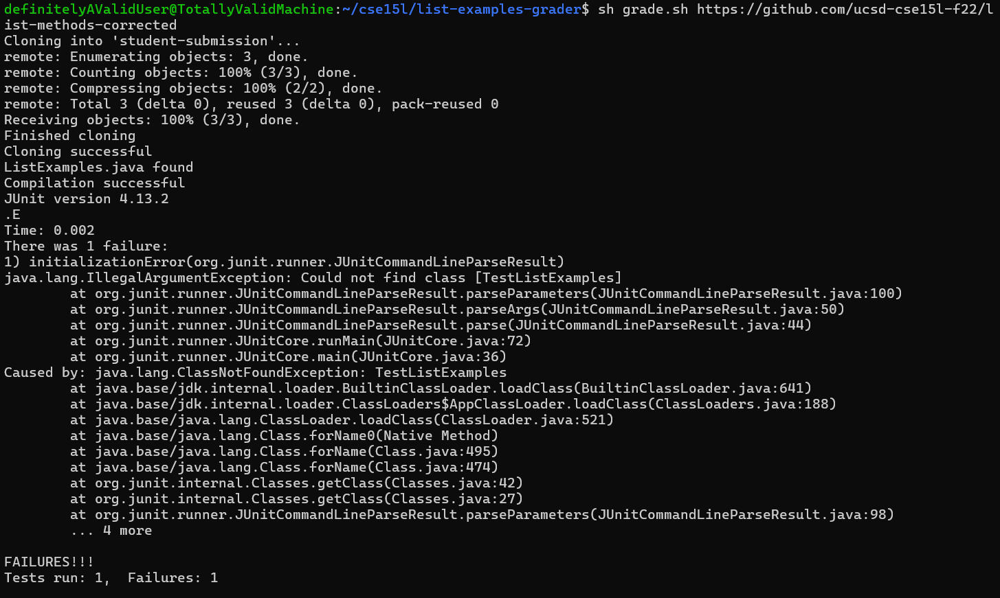
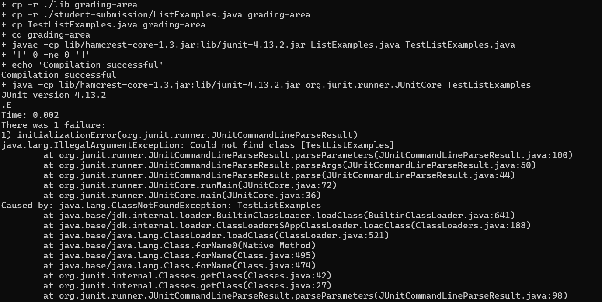
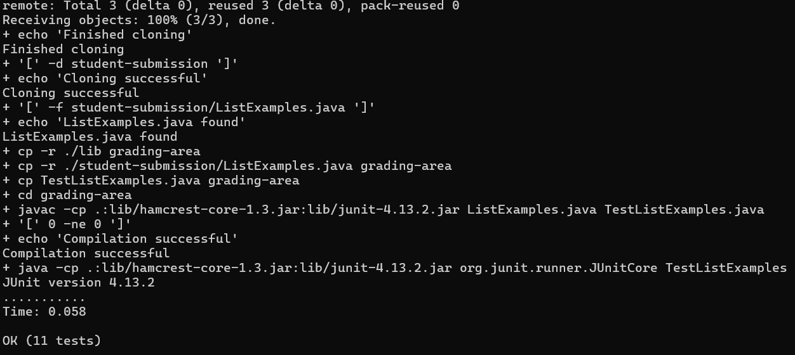

# **Lab Report - 5**

## Issue

A student is trying to run a version of the `grade.sh` script from week 6 but an error is printed as follows. Lets call the student `Jesse`.

Jesse makes a post as follows:

> **grade.sh script is borked need help**
>
> I am trying to run the `grade.sh` script yo it ain't runnin
> 

From this post, it can be determined that the student is clearly very agitated. If we look at the image that was posted, we can deduce that the `TestListExamples` could not be found by the JVM. This class likely contains the test cases that are being run. We also see that the program compiles just fine. So, we can suggest that they check the command that is being run. To do this, we can simply suggest that they use `vim` to open the file and scroll through. However, to avoid ambiguity that arises with the use of variables within the script, we can use the `set -x` flag at the start of the script to show each command and its resective arguments as and when it is being run.

Lets call our instructor Walter White:

> **Walter White:** Hello Jesse. You need to insert the line `set -x` at the start of your bash script. This is known as Trace Mode which will print out the command and its arguments as they are executed. To do this, you can use the `vim` fie editor.

Jesse implements the changes and runs the script again.

> **Jesse:** aight yo I made the changes that you told me to now what
>
>

We can now examine the command that is being executed. Since we are having an issue that involves a class, let us look at the classpath. 

`lib/hamcrest-core-1.3.jar:lib/junit-4.13.2.jar`

Here, we can see that although Jesse might be great at other endeavours in his life, he has not included a reference to the current directory in the classpath. JVM requires this to be set every time. This is usually done automatically, but, in this case, we are changing the classpath variable to include Hamcrest core and jUnit. It is therefore required that we add a reference to the current directory as well. This can be done by adding `.:` to the path, wherein `:` is a separator and `.` acts as a reference to the current directory.

Let us now have Mr. White reply to Jesse.

> **Walter White:** Jesse, I would like to bring your attention to your classpath. JVM requires this to be set every time. This is usually done automatically, but, in this case, we are changing the classpath variable to include Hamcrest core and jUnit. It is therefore required that we add a reference to the current directory as well. This can be done by adding `.:` to the path, wherein `:` is a separator and `.` acts as a reference to the current directory. Your script should then display expected behaviour. If this works, you can then remove `set -x` from your script so the output is cleaner.
> 
> 
> 

Jesse's bug is now fixed and he is elated.

> **Jesse:** YEAH SCIENCE ~~totally not an expletive~~ its fixed now thx yo

## Problem Setup

To set up this problem scenario, the git repository was cloned and the `grade.sh` script edited to exclude `.:` from the classpath. 

## Reflection

Personally, I was familiar with most of the topics that were covered in 15L. However, I learnt a lot about vim and the github CLI, something I would never touch otherwise as I had VS Code set up to where it interfaces flawlessly with GitHub Desktop and WSL. I also loved the lab experience as a whole. I found that interacting with peers and helping them out really improved my knowledge in those topics. 

